<!-- # **Seamless AWS Authentication with Azure AD: A Step-by-Step Integration Guide** -->
# **Configuring SAML (Security Assertion Markup Language) & SCIM (System for Cross-Domain Identity Management): Microsoft Entra ID to AWS IAM Identity Center (formerly AWS SSO)**

https://github.com/user-attachments/assets/91149ee5-83da-4ab6-8100-e050a6ebc1a7

## **Introduction**
Integrating Azure Active Directory (Azure AD) with Amazon Web Services (AWS) allows organizations to unify authentication, enabling users to log in using their existing Azure AD credentials. This integration eliminates the need for multiple credentials and enhances security through Azure AD’s Conditional Access Policies. The process is achieved using **Security Assertion Markup Language (SAML)**, where Azure AD acts as the **Identity Provider (IdP)** and AWS as the **Service Provider (SP)**.

This guide provides a detailed step-by-step approach to configuring **Azure AD Authentication for AWS** using SAML.

---
## **Step 1: Enabling AWS SSO**
### **1.1 Log into AWS Management Console**
- Navigate to [AWS Console](https://aws.amazon.com/console/).
- Search for **IAM Identity Center** in the AWS search bar.
- Click on **IAM Identity Center** to launch the service.
- In the IAM Identity Center dashboard, enable the **SSO Feature**.

### **1.2 Configure Identity Source**
- In the IAM Identity Center dashboard, go to **Settings**.
- Scroll down to **Identity Source**.
- Click on **Actions** → **Change Identity Source**.
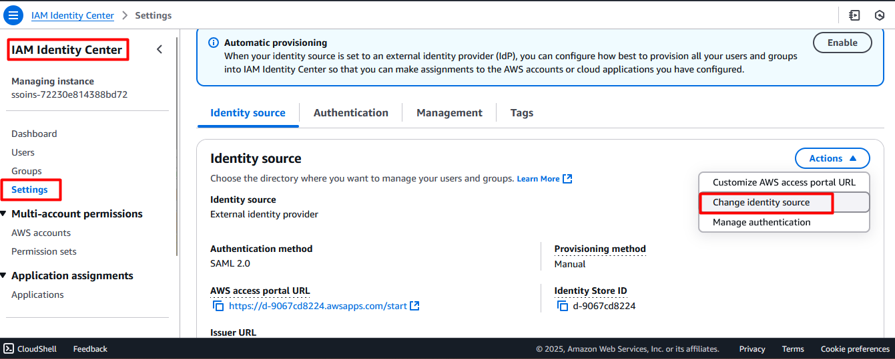
- Choose **External Identity Provider**.
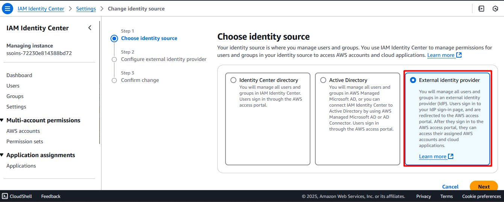
- Click **Next**.

## **Step 2: Configuring SAML in AWS**
### **2.1 Download AWS SAML Metadata**
- Under **Identity Provider Configuration**, download the **AWS SAML Metadata file**.
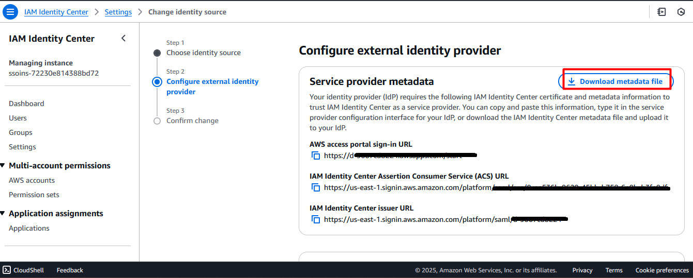
- Save this file for later use in Azure AD configuration.

## **Step 3: Configuring Azure AD for AWS SSO**
### **3.1 Log into Azure Portal**
- Navigate to [Azure Portal](https://portal.azure.com/).
- Select **Miscrosoft Infra ID** from the left panel.
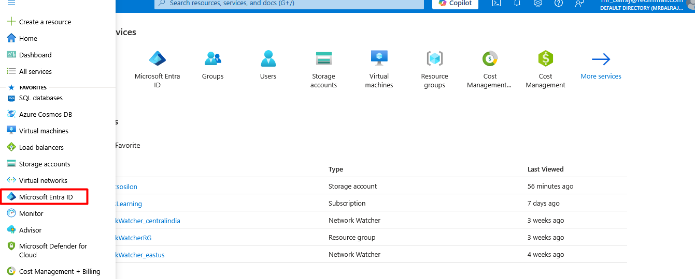
- Click on **Enterprise Applications** → **New Application**.
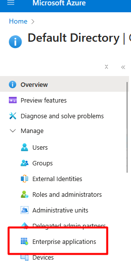
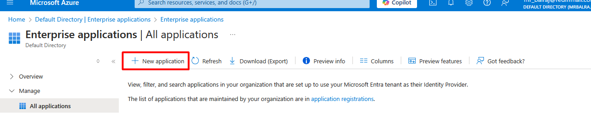
- Search for **AWS IAM Identity Center** and select it.
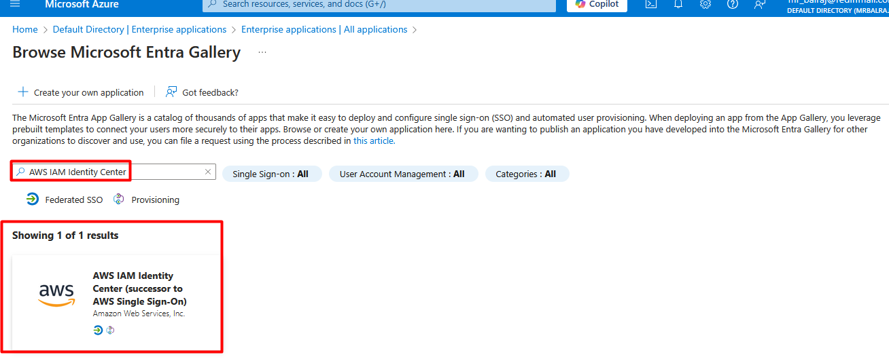
- Click **Create** to add the application.
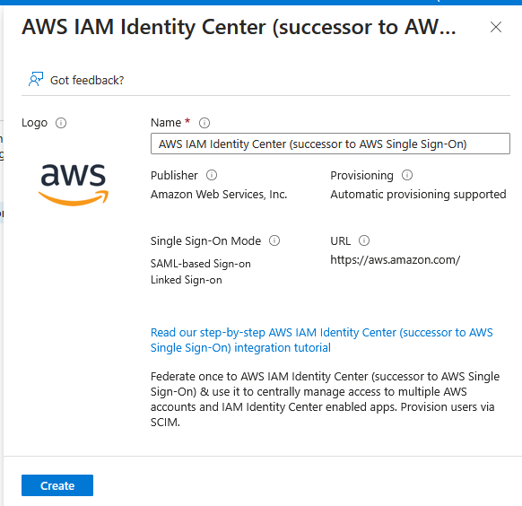

### **3.2 Configure Single Sign-On (SSO)**
- Open the created **AWS IAM Identity Center** application.
- Select **Single Sign-On** → **SAML**.
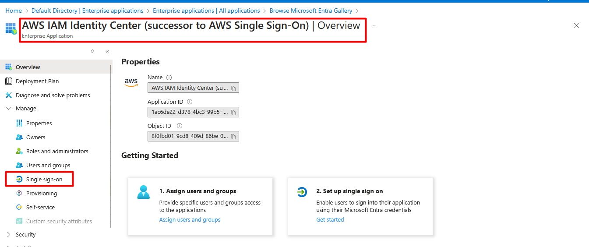
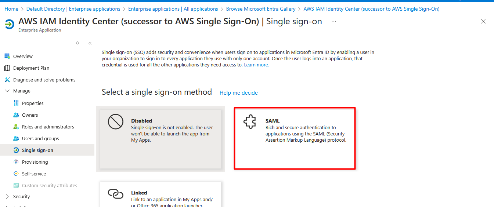
- Click **Upload Metadata File** and select the AWS SAML metadata file downloaded earlier in `steps 2.1`.
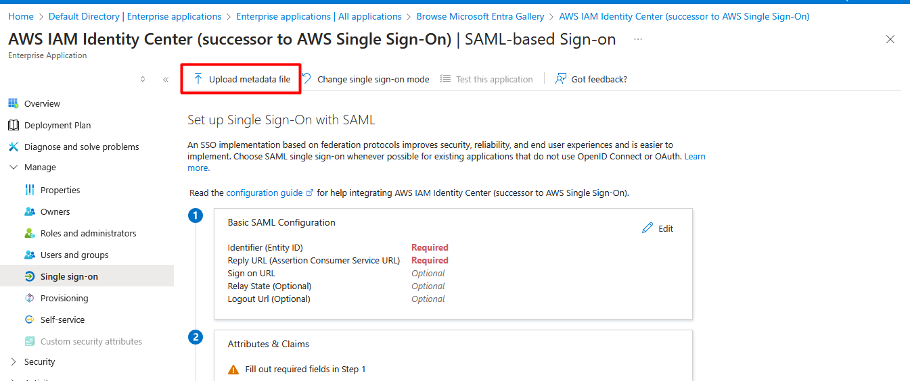
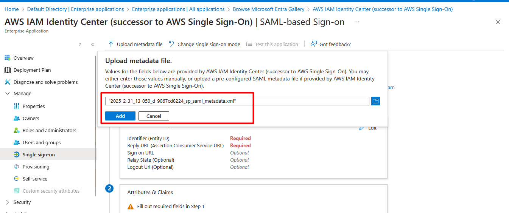
- Click **Save**.
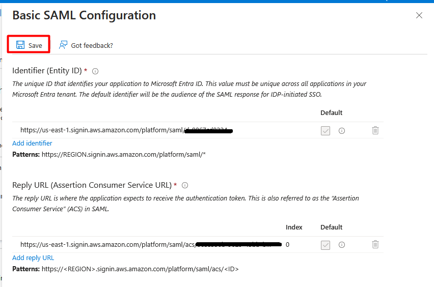

### **3.3 Download Azure AD Federation Metadata**
- In the **SAML Certificates** section, download the **Federation Metadata XML** file.
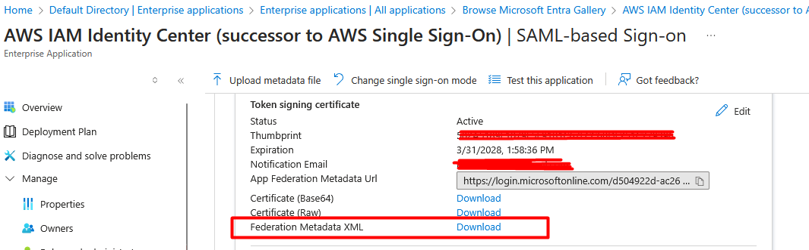
- This file will be used in AWS to complete the SAML configuration.

---
## **Step 4: Configuring SAML in AWS**
### **4.1 Upload Azure AD Metadata to AWS**
- Go back to **AWS IAM Identity Center**.
- Click **Upload IdP SAML Metadata**.
- Select the **Federation Metadata XML** file downloaded from Azure.
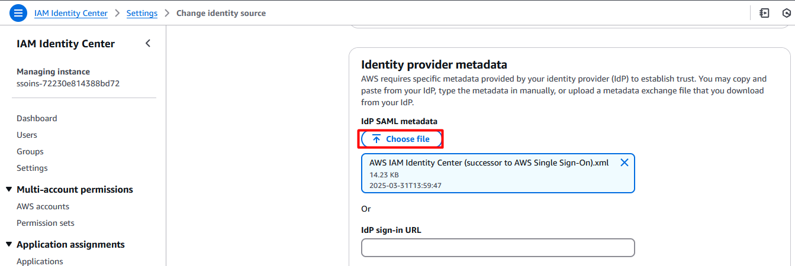
- Click **Next**, review details, accept terms, and click **Change Identity Source**.
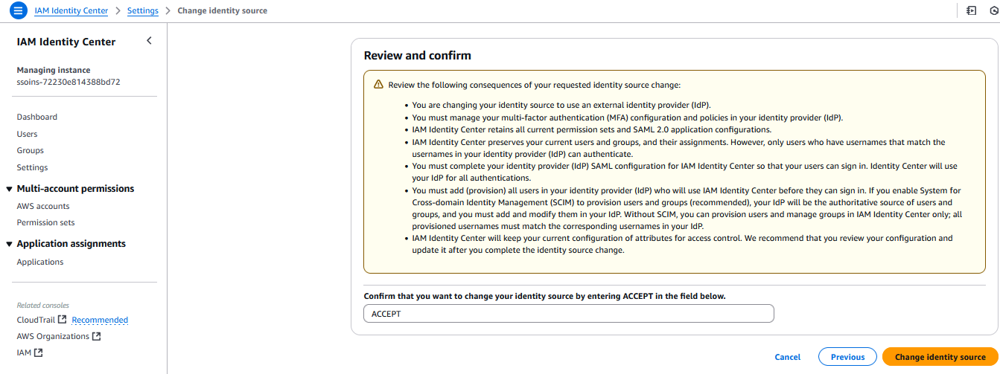

---
## **Step 5: Enabling Automatic User Provisioning**
### **5.1 Retrieve SCIM URL and Token from AWS**
- In **AWS IAM Identity Center**, navigate to **Settings**.
- Enable **Automatic Provisioning**.
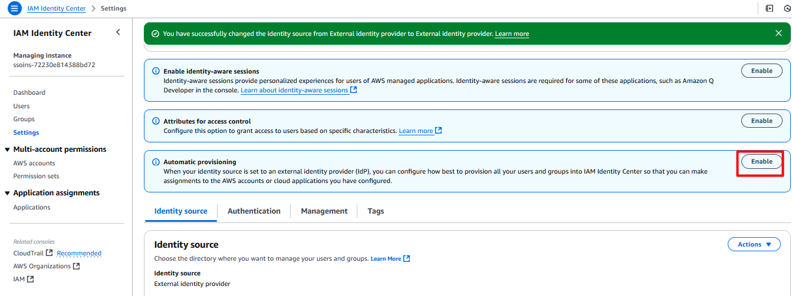
- Copy **SCIM Endpoint URL** and **Access Token**.
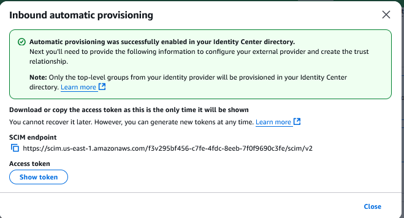

### **5.2 Configure User Provisioning in Azure AD**
- In Azure AD, go to **Enterprise Applications** → **AWS IAM Identity Center**.
- Click on **Provisioning** → **Set Provisioning Mode to Automatic**.
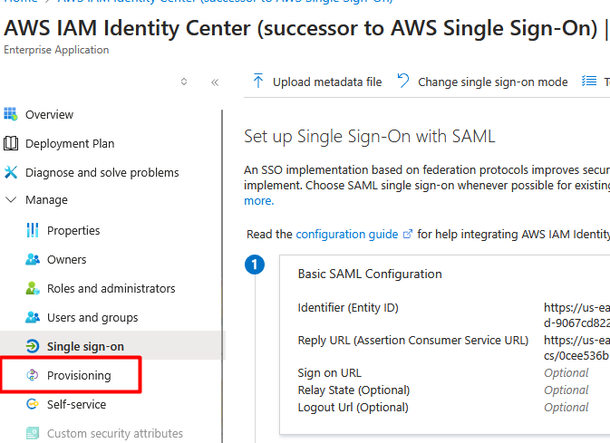
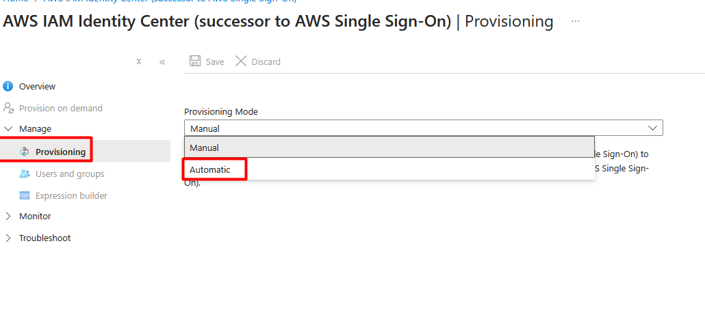
- Paste the **SCIM URL** and **Access Token**.
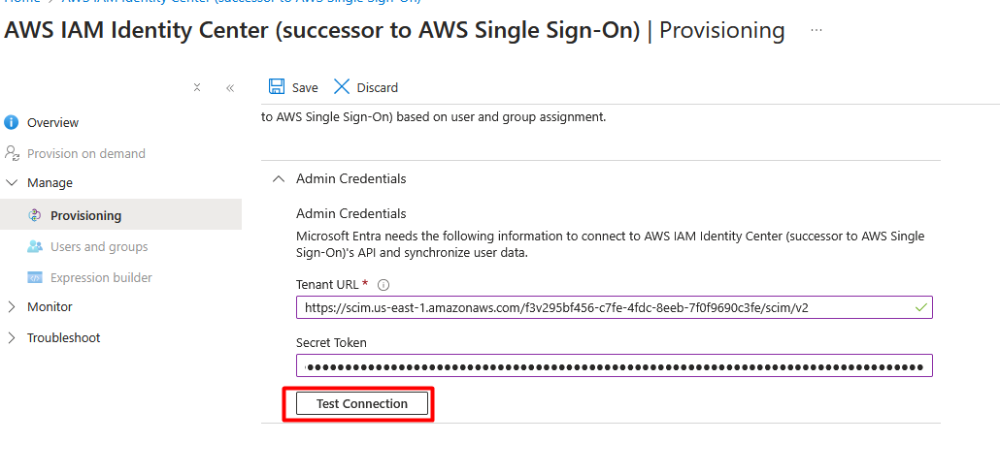
- Click **Test Connection** → If successful, click **Save**.
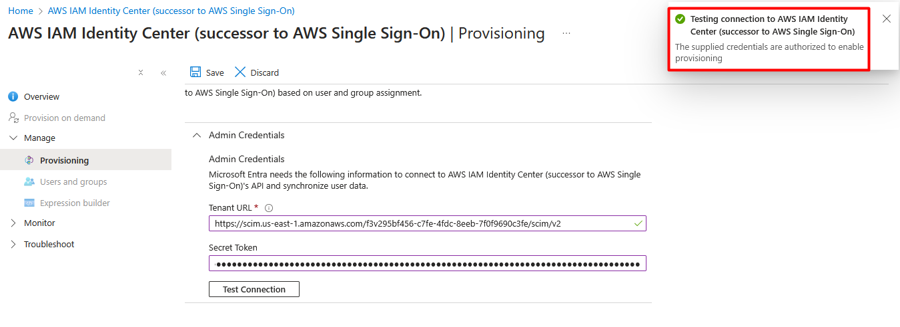
- Click **Start Provisioning**.
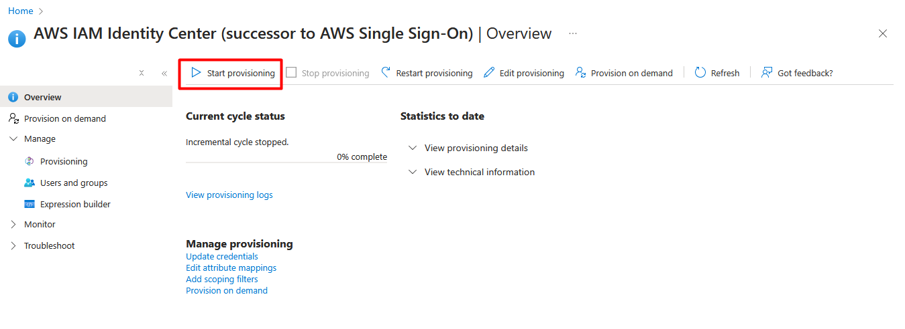

---
## **Step 6: Assigning Users and Groups in Azure AD**
- In **Azure AD**, go to **Enterprise Applications** → **AWS IAM Identity Center**.
- Click **Users and Groups** → **Add User**.
- Select users to assign AWS access.
- Click **Assign**.

> **Note:** Ensure users have **First Name** and **Last Name** attributes populated; otherwise, provisioning may fail.

---
## **Step 7: Assigning AWS Permissions to Users**
- In **AWS IAM Identity Center**, go to **AWS Accounts**.
- Select the account where access is required.
- Click **Assign Users or Groups**.
- Select the user provisioned from Azure AD.
- Click **Next**.

### **7.1 Create a Permission Set**
- Click **Create Permission Set**.
- Choose **Predefined Permission Set** or **Custom Permissions**.
- Select the required permission (e.g., **Administrator Access**).
- Click **Next** → **Create**.
- Go back to the previous screen, select the created permission set, and assign it to the user.

---
## **Step 8: Verifying Login to AWS Using Azure AD**
### **8.1 Access AWS via Azure AD**
- In **AWS IAM Identity Center**, copy the **AWS Access Portal URL**.
- Open an **Incognito Window** and paste the URL.
- It will redirect to **login.microsoftonline.com (Azure AD Login Page)**.
- Enter Azure AD credentials and log in.
- Choose the assigned AWS account and click **Management Console**.
- Successfully access AWS using Azure AD authentication.

---
## **Conclusion**
By integrating Azure AD with AWS, organizations streamline authentication, enhance security, and simplify user management. Azure AD’s **Conditional Access Policies** further strengthen security, providing a **single entity for identity management** across cloud platforms.

**Ref Link**

- [YoutTube- Azure AD Authentication for AWS](https://www.youtube.com/watch?v=R-07SaS1Gig)
- [installing active directory server](https://www.readandexecute.com/how-to/server-2016/active-directory/)

- [Download Microsoft Entra Connect](https://www.microsoft.com/en-us/download/details.aspx?id=47594)
- [Microsoft Entra SSO integration with AWS Single-Account Access](https://learn.microsoft.com/en-us/entra/identity/saas-apps/amazon-web-service-tutorial)