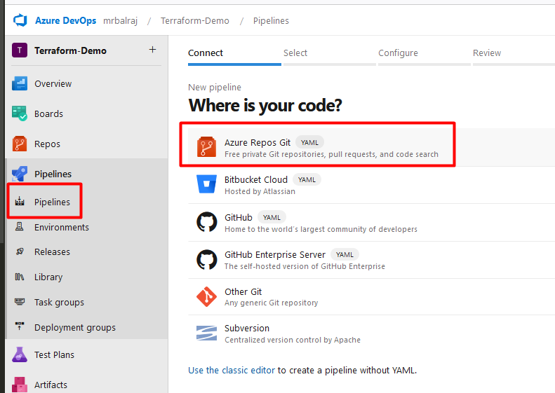

## Technical Document: Azure DevOps Terraform Pipeline

### Overview
This project demonstrates the creation and management of an Azure DevOps pipeline to automate the provisioning and management of infrastructure using Terraform. The pipeline includes steps for initializing, validating, formatting, planning, applying, and destroying infrastructure configurations.

### Key Points
- **Technologies Used**: Azure DevOps, Terraform
- **Pipeline Stages**: Initialization, Validation, Formatting, Planning, Applying, Destroying
- **Infrastructure as Code (IaC)**: Automates infrastructure provisioning and management
- **Service Connections**: Secure authentication and authorization for Azure resources
- **Artifact Management**: Archiving and publishing build artifacts

### Advantages of Using This Project
1. **Automation**: Automates the entire process of infrastructure provisioning, reducing manual effort and errors.
2. **Consistency**: Ensures consistent infrastructure setup across different environments.
3. **Scalability**: Easily scales to manage multiple environments and resources.
4. **Efficiency**: Saves time by automating repetitive tasks and enabling quick deployments.
5. **Version Control**: Integrates with version control systems to track changes and maintain infrastructure configurations.

### Step-by-Step Description

#### 1. Project Setup
- **Clone the Repository**: Clone the project repository from the source control.
- **Import into Azure DevOps**: Import the project into Azure DevOps and set up the necessary service connections.

#### 2. Pipeline Configuration
- **Create Build Pipeline**: Set up a new build pipeline in Azure DevOps.
- **Initialize Terraform**: Add a task to initialize Terraform (`terraform init`).
- **Validate Configuration**: Add a task to validate the Terraform configuration (`terraform validate`).
- **Format Configuration**: Add a task to format the Terraform configuration (`terraform fmt`).
- **Plan Infrastructure**: Add a task to plan the infrastructure changes (`terraform plan`).
- **Archive and Publish Artifacts**: Add tasks to archive and publish the build artifacts.

#### 3. Release Pipeline
- **Create Release Pipeline**: Set up a new release pipeline in Azure DevOps.
- **Extract Artifacts**: Add a task to extract the archived artifacts.
- **Initialize Terraform**: Add a task to initialize Terraform in the release pipeline.
- **Apply Changes**: Add a task to apply the planned infrastructure changes (`terraform apply`).
- **Destroy Infrastructure**: Add a task to destroy the infrastructure (`terraform destroy`).

#### 4. Service Connections
- **Create Service Connection**: Create a service connection in Azure DevOps for secure authentication with Azure.
- **Configure Backend**: Set up the backend configuration for storing Terraform state files in Azure Storage.

#### 5. Testing and Debugging
- **Run Pipelines**: Execute the build and release pipelines to test the infrastructure provisioning and management.
- **Debug Issues**: Use Azure DevOps logs and Terraform output to debug and fix any issues.

### Conclusion
The Azure DevOps Terraform Pipeline project provides a comprehensive solution for automating the provisioning and management of infrastructure using Terraform. By leveraging Azure DevOps and Terraform, this project ensures consistency, efficiency, and scalability in infrastructure management. It serves as an excellent resource for learning and implementing Infrastructure as Code (IaC) practices in real-world scenarios.


Update the ./config.sh Command: Use the --project flag to scope the agent to the Nike-Website project. The updated command would look like this:

```sh
./config.sh --url https://dev.azure.com/<OrganizationName> \
            --auth PAT \
            --token <Tocken_value> \
            --pool <nike-website-pool> \  #Pool Name
            --agent MyAgent001 \   #agent Name
            --project Nike-Website   #Project Name
```
After running the command, the agent should be registered in the nike-website-pool.
Go to Nike-Website > Project Settings > Agent Pools to confirm the agent is listed and active.


Agent is still offline.


- We have to Optionally run the agent interactively. If you didn't run as a service above:
```powershell
~/myagent$ ./run.sh &
```
Now, Agent is online ;-)


- Install terraform extension
  - Go to Organization> Organiazation Setting> General>>Extensions>Browse marketplace


  - serarch for Terraform and download the official one.


# Create a service Principle account.


### <span style="color: Yellow;">**Step-07: Create Service Principle Account**</span>
- Will create a [service principle account](https://www.youtube.com/watch?v=CUHtHGS4xEc&list=PLJcpyd04zn7rxl0X8mBdysb5NjUGIsJ7W&index=3).
- Take putty session of Agent VM and do the following
```sh
az login --use-device-code
```


- To list out all the account
  ```sh
  az account list --output table
  ```
  

  - To get resource details
  ```sh
  az resource list --resource-group "resourceGroupName" --output table
  ```

- To create a SP account
```sh
az ad sp create-for-rbac --name "my-service-principal" --role Contributor --scopes /subscriptions/<SUBSCRIPTION_ID>
```


Show Details of a Service Principal:
```sh
az ad sp show --id <SP_APP_ID_OR_OBJECT_ID>

#Example
az ad sp show --id 00000000-0000-0000-0000-000000000000
```
- List Service Principals:
```sh
az ad sp list --query <query_string>

#Example
az ad sp list --query "[].{Name:displayName, AppId:appId}" --output table
```
- Delete a Service Principal:
```sh
az ad sp delete --id <SP_APP_ID_OR_OBJECT_ID>

#Example
az ad sp delete --id 00000000-0000-0000-0000-000000000000
```

- Reset Credentials for a Service Principal:

```sh
az ad sp credential reset --id  <ID_of_SP>

#Example
az ad sp credential reset --id 00000000-0000-0000-0000-000000000000
```
- Update a Service Principal:
```sh
az ad sp update --id <SP_APP_ID_OR_OBJECT_ID> --add <property>=<value>

#Example
az ad sp update --id 00000000-0000-0000-0000-000000000000 --add tags=MyTag
```

### <span style="color: Yellow;">**Step-08: Configure the Service Connection for "```Azure Resource Manager```"**</span>
   - Steps to configure connection for [Azure Resource Manager](https://learn.microsoft.com/en-us/azure/devops/pipelines/release/configure-workload-identity?view=azure-devops&tabs=managed-identity):


- Verify the Service Connection:
After the command executes successfully, verify the service connection in your Azure DevOps portal under Project Settings > Service Connections.


- Update storage account and value in the azure repo as below.
  
******************

- List of variables


Configure the pipeline.




Now edit the pipeline again for terraform code.
- Terraform init


```sh
      - task: TerraformTaskV4@4
        displayName: Terrafotrm int
        inputs:
          provider: 'azurerm'
          command: 'init'
          backendServiceArm: 'MyAzureServiceConnection'
          backendAzureRmResourceGroupName: 'myfirst-demo-09012025-rg'
          backendAzureRmStorageAccountName: 'storageacct7563c485'
          backendAzureRmContainerName: 'tfstate'
          backendAzureRmKey: 'prod.terraform.tfstate'
```

run the pipeline and it will ask for permission for approval.


pipeline status:


- Terraform validate


```sh
      - task: TerraformTaskV4@4
        displayName: Terraform validate
        inputs:
          provider: 'azurerm'
          command: 'validate'
```

- Terraform formatting


```sh
      - task: TerraformTaskV4@4
        displayName: Terraform formatting
        inputs:
          provider: 'azurerm'
          command: 'custom'
          outputTo: 'console'
          customCommand: 'fmt'
          environmentServiceNameAzureRM: 'MyAzureServiceConnection'
```

- Terraform plan

```sh
      - task: TerraformTaskV4@4
        displayName: Terraform plan
        inputs:
          provider: 'azurerm'
          command: 'plan'
          commandOptions: '-out $(Build.SourcesDirectory)/tfplanfile'
          environmentServiceNameAzureRM: 'MyAzureServiceConnection'
```

Pipeline Status


- Archive the file.
  


```sh
      - task: ArchiveFiles@2
        displayName: Archive Files
        inputs:
          rootFolderOrFile: '$(Build.SourcesDirectory)'
          includeRootFolder: true
          archiveType: 'zip'
          archiveFile: '$(Build.ArtifactStagingDirectory)/$(Build.BuildId).zip'
          replaceExistingArchive: true
```
  

- Publish the artifact


```sh
      - task: PublishBuildArtifacts@1
        displayName: Publish Artifact
        inputs:
          PathtoPublish: '$(Build.ArtifactStagingDirectory)'
          ArtifactName: '$(Build.BuildId)-build'
          publishLocation: 'Container'
```

Pipeline failed


As I am using self hosted agent and zip package need to be installed. So, I have updated the script file, so future, it won't be create problem.
```sh
sudo apt-get update
sudo apt-get install -y zip
```

Pipeline is executed successfully.


# Release pipeline.


Rename Stage


- add artifact


- Enable auto Trigger


- configure Job


- add more stage.
  - Extract Files


  - Archive file patterns
  ```sh
  _$(Build.DefinitionName)/$(Build.BuildId)-build/$(Build.BuildId).zip
  ```
  - Destination folder
```sh
'$(System.DefaultWorkingDirectory)/'
```
  - Install Terraform Latest 


  
  - install terraform (init)
  
  
  

  - Install terraform (Apply)
  

  save it and clone new stage as "Destroy"
  
  
  - change from apply to Destroy
  

  - add approval stage before destroy it.
  


- got error in cd pipeline.


Edit the build pipeline and make changes in artifact stage as below
```sh
      - task: ArchiveFiles@2
        displayName: Archive Files
        inputs:
          #rootFolderOrFile: '$(Build.SourcesDirectory)'
          rootFolderOrFile: '$(Build.SourcesDirectory)/'
          #includeRootFolder: true
          includeRootFolder: false
          archiveType: 'zip'
          archiveFile: '$(Build.ArtifactStagingDirectory)/$(Build.BuildId).zip'
          replaceExistingArchive: true
```

again pipeline failed on same state.


Now, issue in CD pipeline.

Solution:

- State: Extract files
  - `Destination folder`  value would be 
```sh
'$(System.DefaultWorkingDirectory)/'
```
- Stage: Terraform init & Apply 
  - ```Configuration directory```  value would be
```sh
'$(System.DefaultWorkingDirectory)/'
```

Pipeline working fine.


# Stage for Destroy

Note--> don't forget to update in the destroy stage as well.
- Stage: Terraform init & Apply 
  - ```Configuration directory``` value would be
```sh
'$(System.DefaultWorkingDirectory)/'
```

- It's waiting for approval to destroy


pipeline works


**Additional Steps:**

- Check Logs for All Locations: Remove the location=='westus2' filter to check logs for all locations.
```bash
az monitor activity-log list \
  --start-time "$(date --utc --date='1 hour ago' +%Y-%m-%dT%H:%M:%SZ)" \
  --end-time "$(date --utc +%Y-%m-%dT%H:%M:%SZ)" \
  --resource-group "singh-rg" \
  -o table
```
- Check Logs Without Filters: Remove all filters to ensure activity logs are being fetched.
```bash
az monitor activity-log list \
  --start-time "$(date --utc --date='1 hour ago' +%Y-%m-%dT%H:%M:%SZ)" \
  --end-time "$(date --utc +%Y-%m-%dT%H:%M:%SZ)" \
  -o table
```
- Validate Resource Group Name: Ensure that the resource group singh-rg exists and you have access.
```bash
az group show --name "singh-rg"
```
- List Current Resources in the Region: Check if resources currently exist in westus2 for validation.
```bash
az resource list --location "westus2" --resource-group "singh-rg" -o table
```


https://learn.microsoft.com/en-us/azure/devops/repos/git/branch-policies?view=azure-devops&tabs=browser