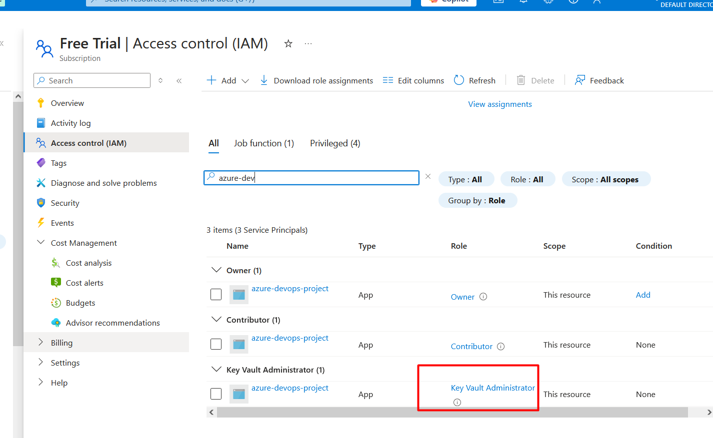

https://registry.terraform.io/providers/hashicorp/azuread/latest/docs/resources/service_principal
https://medium.com/@piyush.sachdeva055/deploy-aks-cluster-in-azure-with-terraform-2028f6c71ada
https://github.com/piyushsachdeva/Terraform_AKS

https://registry.terraform.io/providers/hashicorp/azuread/latest/docs/resources/service_principal

https://k21academy.com/terraform-iac/create-manage-aks-cluster-using-terraform/

https://spacelift.io/blog/terraform-aks

https://registry.terraform.io/providers/hashicorp/azurerm/latest/docs/resources/key_vault_secret

https://github.com/piyushsachdeva/Terraform_AKS/


az ad sp show --id a8a9a098-64dc-4035-ba05-57551c26b8a6

az role assignment create \
  --assignee a8a9a098-64dc-4035-ba05-57551c26b8a6 \
  --role "User Access Administrator" \
  --scope "/subscriptions/2fc598a4-6a52-44b9-b476-6a62640513f8"


```sh
The error indicates that the service principal used to run the Terraform script does not have sufficient privileges to create an Azure AD application. You need to ensure that the service principal has the necessary permissions.

### Steps to Resolve:
1. **Assign the Required Permissions:**
   - Ensure the service principal has the `Application.ReadWrite.All` permission in Azure AD.
   - You can assign this permission through the Azure portal or using Azure CLI.

### Using Azure Portal:
1. Navigate to `Azure Active Directory` > `App registrations`.
2. Find and select your service principal.
3. Go to `API permissions` > `Add a permission`.
4. Select `Microsoft Graph` > `Application permissions`.
5. Add `Application.ReadWrite.All`.
6. Grant admin consent for the permissions.

### Using Azure CLI:
```sh
az ad app permission add --id <your-service-principal-id> --api 00000003-0000-0000-c000-000000000000 --api-permissions 5b567255-7703-4780-807c-7be8301ae99b=Role
az ad app permission grant --id <your-service-principal-id> --api 00000003-0000-0000-c000-000000000000
az ad app permission admin-consent --id <your-service-principal-id>
```

Replace `<your-service-principal-id>` with the actual ID of your service principal.

After assigning the required permissions, re-run the Terraform script.


```

```sh
You can get the service principal ID using the Azure CLI. Here are the steps:

### Using Azure CLI:
1. **List Service Principals:**
   ```sh
   az ad sp list --query "[].{displayName:displayName, appId:appId, objectId:objectId}"
   ```

2. **Get a Specific Service Principal by Name:**
   ```sh
   az ad sp show --id <service-principal-name> --query "objectId"
   ```

Replace `<service-principal-name>` with the name of your service principal.

### Example:
```sh
az ad sp show --id "test-balraj-spn" --query "objectId"
```

This command will return the `objectId` of the specified service principal.
```
```sh
The error indicates that the service principal with the name `test-balraj-spn` does not exist. You need to ensure that the service principal is created and exists in your Azure AD.

### Steps to Create a Service Principal:
1. **Create a Service Principal:**
   ```sh
   az ad sp create-for-rbac --name "test-balraj-spn"
   ```

2. **Get the Service Principal ID:**
   ```sh
   az ad sp show --id "test-balraj-spn" --query "objectId"
   ```

### Example:
```sh
# Create the service principal
az ad sp create-for-rbac --name "test-balraj-spn"

# Get the service principal ID
az ad sp show --id "test-balraj-spn" --query "objectId"
```

This will create a new service principal with the name `test-balraj-spn` and then retrieve its `objectId`. After creating the service principal, you can proceed with assigning the necessary permissions and re-running the Terraform script.
```

